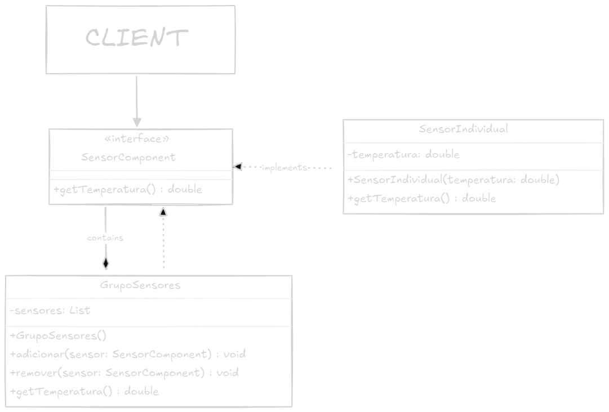

# Design Pattern Composite

## Objetivo

> Compor objetos em estruturas de árvore para representar hierarquias parte-todo. Composite permite aos clientes tratarem de maneira uniforme objetos individuais e composições de objetos.

## Estrutura

> A estrutura do padrão Composite é composta por três elementos: Component, Leaf e Composite.

1. **Component**: Define a interface para objetos da composição. Declara uma interface para acessar e gerenciar componentes filhos.
2. **Leaf**: Representa objetos folha da composição. Implementa comportamentos específicos para objetos folha.
3. **Composite**: Representa objetos que possuem filhos. Implementa comportamentos específicos para objetos compostos.
4. **Client**: Manipula objetos da composição através da interface definida por Component.

## Aplicabilidade

> Use o padrão Composite quando:
> - Deseja representar objetos em uma hierarquia parte-todo.
> - Deseja que clientes tratem objetos individuais e composições de objetos de maneira uniforme.
> - Deseja que os clientes ignorem a diferença entre objetos individuais e composições de objetos.
> - Deseja que os clientes possam tratar de maneira uniforme objetos individuais e composições de objetos.

## UML

