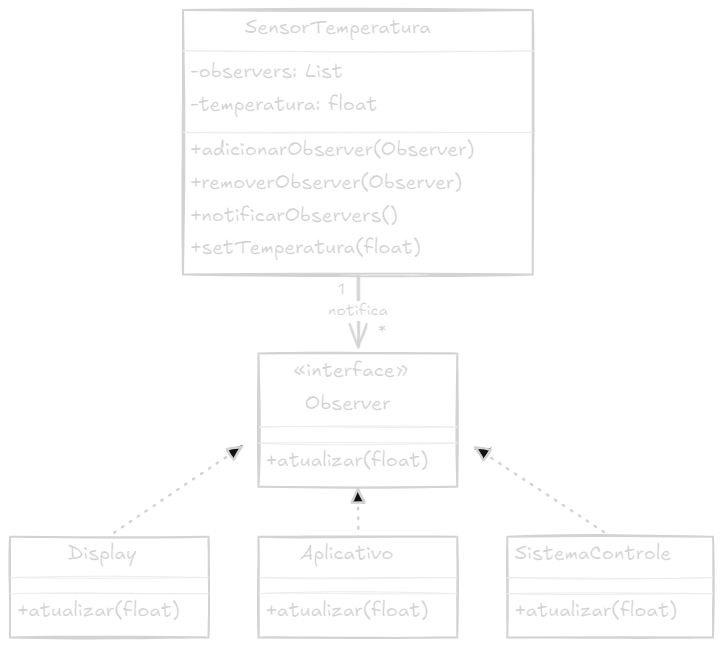

# Design Pattern Observer

## Objetivo

> O padrão Observer é um padrão de design comportamental que permite que um objeto publique alterações de estado para todos os seus observadores (dependentes). Os observadores são notificados e atualizados automaticamente sempre que o objeto sofre alguma alteração de estado.

## Estrutura

> A estrutura do padrão Observer é relativamente simples. O objeto que deseja monitorar alterações de estado em outro objeto é chamado de Observador. O objeto que está sendo observado é chamado de Sujeito. O Sujeito mantém uma coleção de Observadores e notifica todos eles quando muda de estado.

# UML

