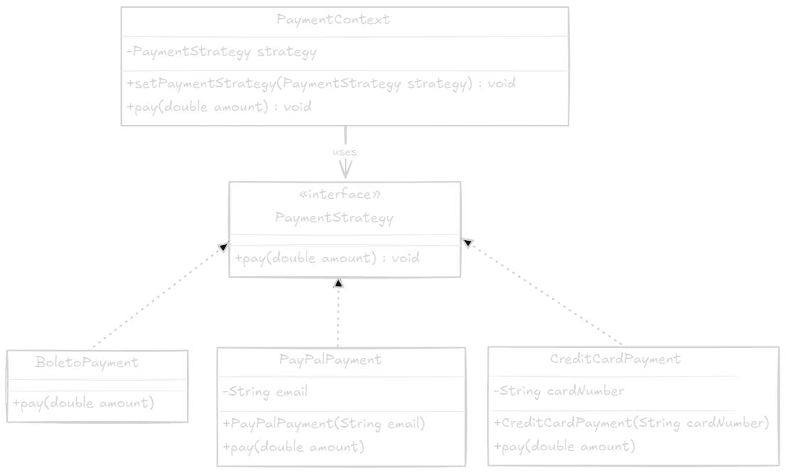

# Design Pattern Strategy

## Objetivo

> O padrão de projeto Strategy tem como objetivo definir uma família de algoritmos, encapsular cada um deles e torná-los intercambiáveis. O padrão Strategy permite que o algoritmo varie independentemente dos clientes que o utilizam.

## Estrutura

> A estrutura do padrão Strategy é composta por três elementos:

1. **Contexto (Context):** É a classe que mantém uma referência para a interface Strategy e é responsável por chamar o algoritmo definido pela interface Strategy.
2. **Interface Strategy:** Define a interface comum para todos os algoritmos suportados.
3. **Implementações Concretas (Concrete Strategies):** São as classes que implementam a interface Strategy.

## UML

